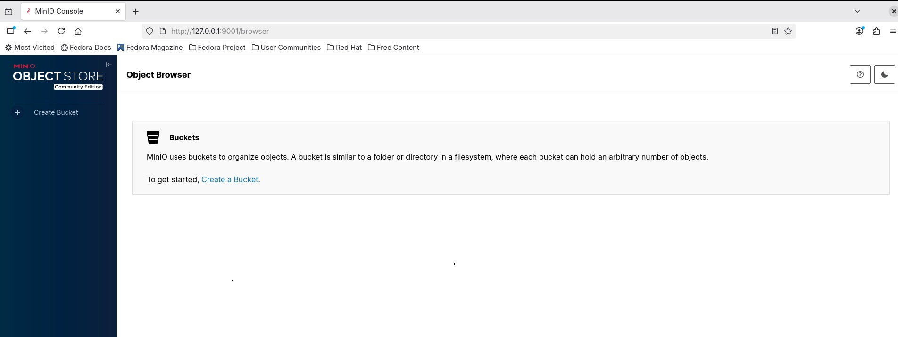

# Local Enterprise Data Lake Architecture (Fedora Linux)

This repository tracks the configuration, deployment, and testing pipelines for a production-grade local data lake. The architecture decouples storage and compute by running a bare-metal distributed object storage layer managed by systemd, alongside an isolated Python virtual environment executing PySpark pipelines.

---

## Architecture Overview

- **Storage Layer:** MinIO Object Storage (Native Linux Binary running as a system daemon)
- **Compute Engine:** Apache Spark / PySpark 3.x
- **Execution Environment:** Isolated Python 3 Virtual Environment (`pyspark_env`)
- **Runtime Dependency:** OpenJDK 21
- **Storage Pool:** Local storage mounted at `/mnt/minio_data`

---

# Phase 1: Storage Layer Configuration (MinIO Native)

## 1. System Directories & Security Boundary

MinIO is executed via an isolated system user with no interactive login shell.

### Paths

- Binary: `/usr/local/bin/minio`
- Data Directory: `/mnt/minio_data`
- Config: `/etc/default/minio`
- Service: `/etc/systemd/system/minio.service`

## 2. User & Directory Provisioning

```bash
sudo useradd -r -s /sbin/nologin minio-user

sudo mkdir -p /mnt/minio_data
sudo chown -R minio-user:minio-user /mnt/minio_data
```

## 3. Binary Installation

```bash
wget https://dl.min.io/server/minio/release/linux-amd64/minio

chmod +x minio
sudo mv minio /usr/local/bin/minio
```

## 4. Environment Configuration

Create:

```bash
sudo nano /etc/default/minio
```

Contents:

```text
MINIO_VOLUMES="/mnt/minio_data"
MINIO_OPTS="--address :9000 --console-address :9001"
MINIO_ROOT_USER="admin"
MINIO_ROOT_PASSWORD="your-strong-password-here"
```

## 5. Systemd Service Configuration

Create:

```bash
sudo nano /etc/systemd/system/minio.service
```

Contents:

```ini
[Unit]
Description=MinIO
Documentation=https://min.io/docs/minio/linux/index.html
Wants=network-online.target
After=network-online.target
AssertFileIsExecutable=/usr/local/bin/minio

[Service]
WorkingDirectory=/usr/local
User=minio-user
Group=minio-user
ProtectProc=invisible

EnvironmentFile=/etc/default/minio
ExecStart=/usr/local/bin/minio server $MINIO_OPTS $MINIO_VOLUMES

Restart=always
LimitNOFILE=65536

[Install]
WantedBy=multi-user.target
```
## 6. Service Registration & Control

```bash
sudo systemctl daemon-reload

sudo systemctl enable minio

sudo systemctl start minio
sudo systemctl stop minio
sudo systemctl restart minio

sudo systemctl status minio

sudo journalctl -u minio.service -f
```

## 7. Firewall Configuration

```bash
sudo firewall-cmd --add-port=9000/tcp --permanent
sudo firewall-cmd --add-port=9001/tcp --permanent
sudo firewall-cmd --reload
```

---

# Phase 2: Compute Layer Configuration (PySpark)

## 1. Install Java 21

```bash
sudo dnf install java-21-openjdk-devel -y

java -version
```

## 2. Create Python Virtual Environment

```bash
sudo dnf install python3-venv -y

cd ~/home_datalake

python3 -m venv pyspark_env

source pyspark_env/bin/activate
```

## 3. Install Core Dependencies

```bash
pip install --upgrade pip

pip install pyspark jupyterlab
```

---

## Verification

### Verify MinIO

Open:

- http://localhost:9001

Login using:

- Username: admin
- Password: your configured password

### Verify Spark

```bash
pyspark
```

If the Spark shell starts successfully, your compute layer is ready.

---

## Future Enhancements

- MinIO Buckets for Bronze, Silver, Gold data layers
- Apache Iceberg
- Delta Lake
- MLflow
- Airflow
- Dask Integration
- Kubernetes Deployment
